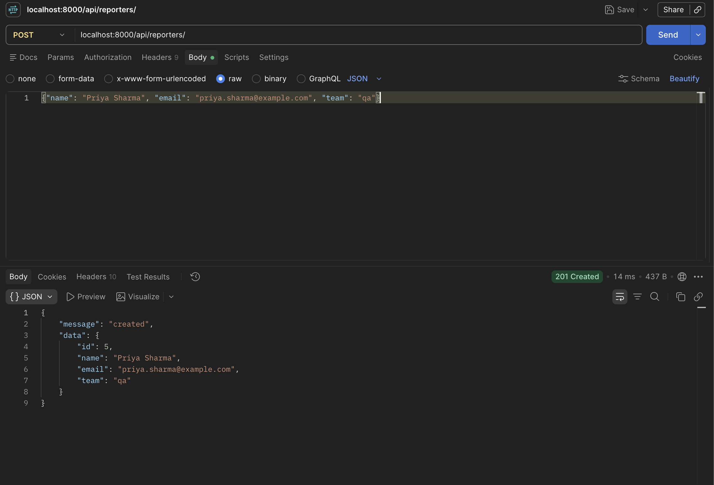
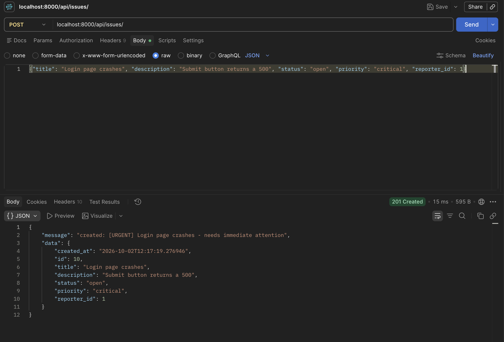

# devtrack

A small Django REST API for tracking reporters and issues. Data is stored in JSON files under `issues/files/`.

## Setup

Requires Python 3.12+.

```bash
python3 -m venv .venv
source .venv/bin/activate
pip install django djangorestframework
```

## Run the server

```bash
python manage.py runserver
```

The API is now available at `http://127.0.0.1:8000/api/`.

## Reporter endpoints

Base URL: `/api/reporters/` (keep the trailing slash)

| Method | URL | Description |
|--------|-----|-------------|
| `POST` | `/api/reporters/` | Create a reporter |
| `GET` | `/api/reporters/` | List all reporters |
| `GET` | `/api/reporters/?id=1` | Get one reporter by id |

**Create a reporter**

```bash
curl -X POST http://127.0.0.1:8000/api/reporters/ \
  -H "Content-Type: application/json" \
  -d '{"name": "Priya Sharma", "email": "priya.sharma@example.com", "team": "qa"}'
```

| Field | Rules |
|-------|-------|
| `name` | required, not empty |
| `email` | required, must contain `@` |
| `team` | required, one of `backend`, `frontend`, `qa`, `devops` |

The `id` is assigned by the server.

**Responses**

| Status | When |
|--------|------|
| `201` | Reporter created |
| `200` | Reporter(s) returned |
| `400` | Missing fields, invalid team or email, or non-numeric `id` |
| `404` | No reporter with that `id` |
| `405` | Method not allowed (for example `DELETE`) |

Example (`201 Created`):



More Postman screenshots, one for each success and error case, are in [`photos/reporters/`](photos/reporters/).

## Issue endpoints

Base URL: `/api/issues/` (keep the trailing slash)

| Method | URL | Description |
|--------|-----|-------------|
| `POST` | `/api/issues/` | Create an issue |
| `GET` | `/api/issues/` | List all issues |
| `GET` | `/api/issues/?status=open` | List issues, filtered |
| `GET` | `/api/issues/?id=1` | Get one issue by id |

**Create an issue**

```bash
curl -X POST http://127.0.0.1:8000/api/issues/ \
  -H "Content-Type: application/json" \
  -d '{"title": "Login fails", "description": "500 on submit", "status": "open", "priority": "high", "reporter_id": 1}'
```

| Field | Rules |
|-------|-------|
| `title` | required, not empty |
| `description` | required, not empty |
| `status` | required, one of `open`, `in_progress`, `resolved`, `closed` |
| `priority` | required, one of `low`, `medium`, `high`, `critical` |
| `reporter_id` | required, must be the id of an existing reporter |

The `id` and `created_at` are set by the server.

**Filters**

Combine any of `status`, `priority` and `reporter_id` (all must match):

```
GET /api/issues/?status=open&priority=high&reporter_id=1
```

An invalid filter value or an unknown filter name returns `400`.

**Responses**

Every response uses one of two shapes:

| Shape | Used for |
|-------|----------|
| `{"message": "...", "data": ...}` | success (`2xx`) |
| `{"error": "..."}` | failure (`4xx`) |

| Status | When |
|--------|------|
| `201` | Issue created |
| `200` | Issue(s) returned (an empty list is still `200`) |
| `400` | Missing fields, invalid values or filters, unknown `reporter_id`, malformed JSON, or non-numeric `id` |
| `404` | No issue with that `id` |
| `405` | Method not allowed (for example `DELETE`) |

Example (`201 Created`):



More Postman screenshots, one for each success and error case, are in [`photos/issues/`](photos/issues/).

## Design notes

- **Enums as classes:** `Team`, `Status` and `Priority` are `StrEnum`s, so the allowed values live in one place and serialize as plain strings.
- **Shared `invalid_message`:** a `ChoiceEnum` base class method builds the "Invalid ... Allowed values: ..." error, used by both model validation and query filters.
- **One router per URL:** Django maps a URL to one view, so `route_reporters_root` and `route_issues_root` dispatch on the HTTP method and `?id=` to small, separate handlers (`create_*`, `list_*`, `get_*`).
- **Three filters on list:** `status`, `priority` and `reporter_id` can be combined, and `Issue.FILTER_FIELDS` is the single list of allowed filter names.
- **Enum-driven filters:** `ENUM_FILTERS` maps a filter name to its enum, so validating a new enum filter takes one entry, not a new `if` block.
- **Issue classes:** `CriticalIssue` and `LowPriorityIssue` extend `Issue` and override `describe()`, and `ISSUE_CLASSES` picks the class from the priority.
- **Models validate, views handle HTTP:** each model has a `validate()` that raises `ValueError`, and the views turn that into a `400`.
